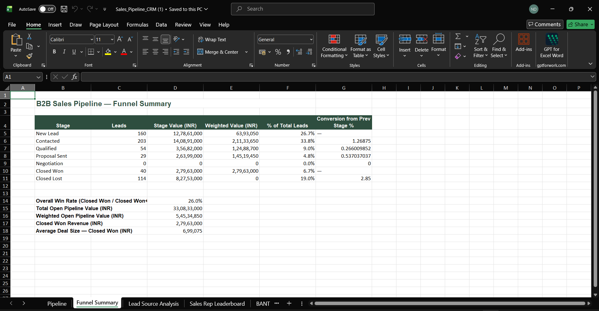

# B2B Sales Pipeline & Funnel Analysis

> Note: This is a synthetic portfolio simulation. All companies, contacts, sales data, and performance metrics are illustrative and do not represent real company or customer data.

## Project Overview

This project analyzes a simulated 600-lead B2B SaaS sales pipeline using Excel, SQL, and the BANT qualification framework.

The analysis follows leads from New Lead through Contacted, Qualified, Proposal Sent, Negotiation, Closed Won, and Closed Lost stages.

## Tools Used

- Microsoft Excel
- SQL / PostgreSQL
- BANT Qualification Framework
- CRM Reporting
- Sales Funnel Analysis

## Project Files

| File | Purpose |
|---|---|
| `Sales_Pipeline_CRM.xlsx` | CRM data and Excel dashboard with funnel, lead-source, sales-rep, BANT, and lost-reason analysis |
| `pipeline_analysis.sql` | SQL schema and funnel/conversion analysis queries |
| `pipeline_leads.csv` | Synthetic 600-lead sales-pipeline dataset |
| `outreach_templates.md` | BANT discovery questions, cold-email templates, LinkedIn outreach, follow-ups, and objection handling |

## Dashboard Preview

### Funnel Summary

### Lead Source Analysis

### BANT Qualification Analysis

### Lost Deal Reasons

## Key Insights

- Referral leads were the highest-converting channel at 14.3%.
- BANT scores of 18–20 produced a 30.0% win rate, compared with 2.6% for scores of 0–10.
- Cold Outbound created the largest lead volume but converted at only 2.3%.
- “Chose competitor” and “No decision / went dark” were the most common lost-deal reasons.
- The analysis recommends a stronger referral strategy, strict BANT qualification, improved follow-up cadence, and sales-rep coaching.

## Skills Demonstrated

- Sales pipeline management
- Funnel and conversion analysis
- BANT lead qualification
- Excel formulas and dashboard reporting
- SQL aggregation and business analysis
- Lead-source performance analysis
- Sales outreach strategy
